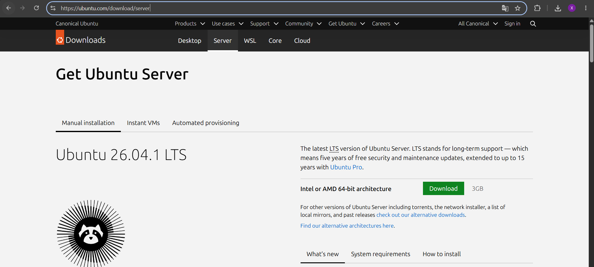

Se ha elegido Ubuntu Server 24.04 LTS como sistema operativo encargado de ejercer la función de recolectar y centralizar las alertas. 
Además, permte una instalación basados en línea de comandos (CLI), lo cual permite la reducción de consumo de recursos. 
La fuente utilizada para la descarga es: https://ubuntu.com/download/server

# Creación de la máquina virtual 
Se ha creado la máquina en VirtualBox con la siguiente configuración: 

|     Parámetro    |                 Valor                 |
|------------------|---------------------------------------|
| Nombre           | SOC-Splunk                            |
| RAM              | 4096 MB                               |
| CPU virtuales    | 2                                     |
| Disco            | VDI de 40 GB, reservado dinámicamente |
| Adaptador de red | NAT                                   |
