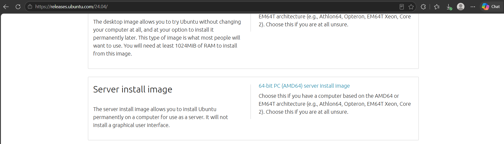
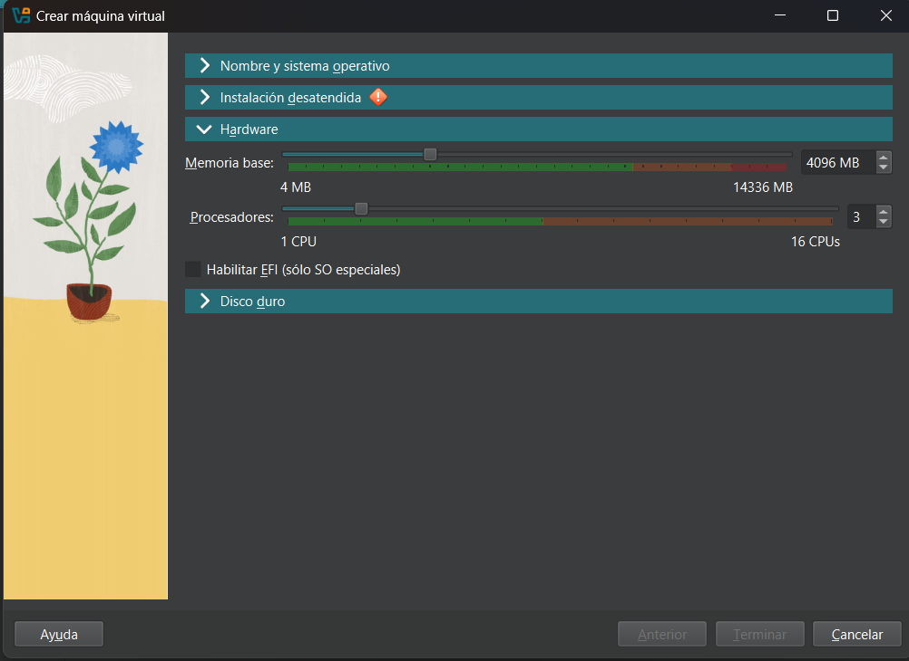
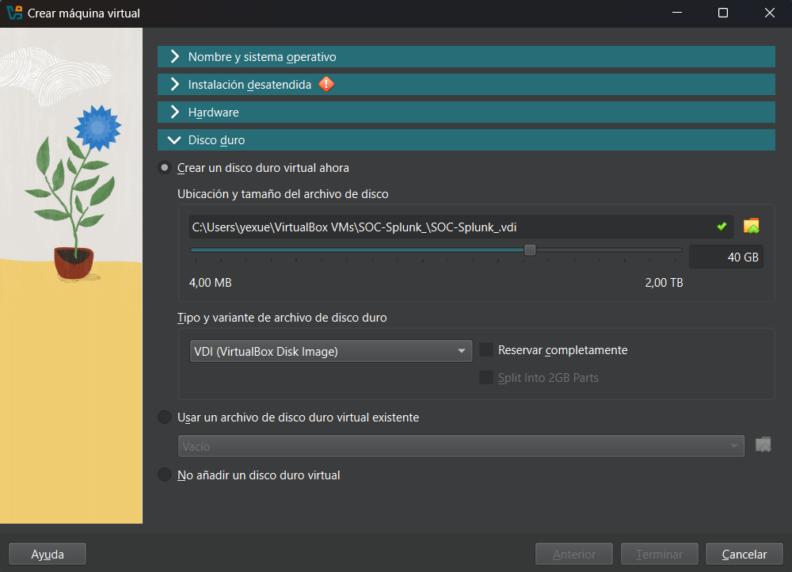

Se ha elegido Ubuntu Server 24.04 LTS como sistema operativo encargado de alojar Splunk, que será quien centralice los registros y genere las alertas. 
Además, permte una instalación basados en línea de comandos (CLI), lo cual permite la reducción de consumo de recursos. 
La fuente utilizada para la descarga es: https://ubuntu.com/download/server

## Creación de la máquina virtual
Se ha creado la máquina en VirtualBox con la siguiente configuración: 

|     Parámetro    |                 Valor                 |
|------------------|---------------------------------------|
| Nombre           | SOC-Splunk                            |
| RAM              | 4096 MB                               |
| CPU virtuales    | 2                                     |
| Disco            | VDI de 40 GB, reservado dinámicamente |
| Adaptador de red | NAT                                   |

## Instalación de Ubuntu Server

Durante la instalación se seleccionaron las siguientes opciones:

- Instalación estándar de Ubuntu Server.
- Sin entorno gráfico, utilizando únicamente interfaz de línea de comandos (CLI).
- Particionado guiado del disco virtual.
- Sin configuración de LVM, utilizando una partición ext4 principal.
- Instalación de OpenSSH Server para permitir la administración remota de la máquina.

El usuario creado para la administración del sistema fue:

- Usuario: `soc-admin`
- Nombre del servidor: `soc-splunk`

No se seleccionaron paquetes adicionales durante la instalación.

## Configuración inicial de red

La máquina virtual utiliza un adaptador de red en modo NAT.

Durante la instalación se obtuvo una dirección IP mediante DHCP,
permitiendo la conexión a Internet para la descarga de paquetes y actualizaciones.
