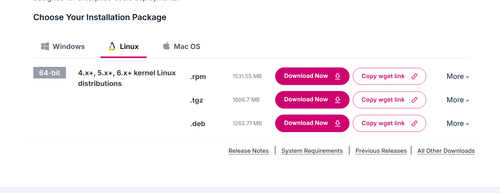
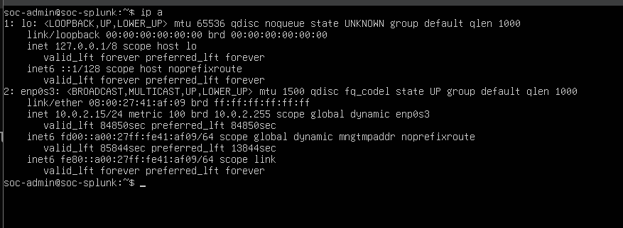
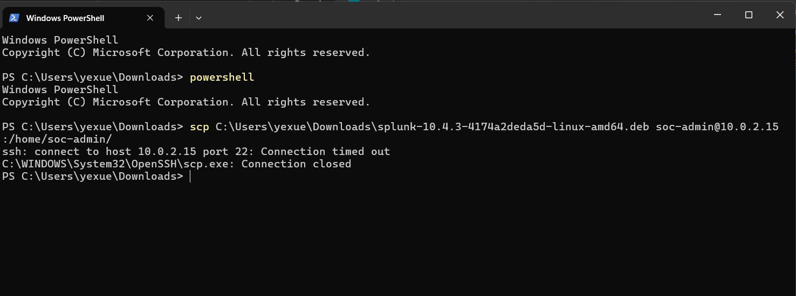
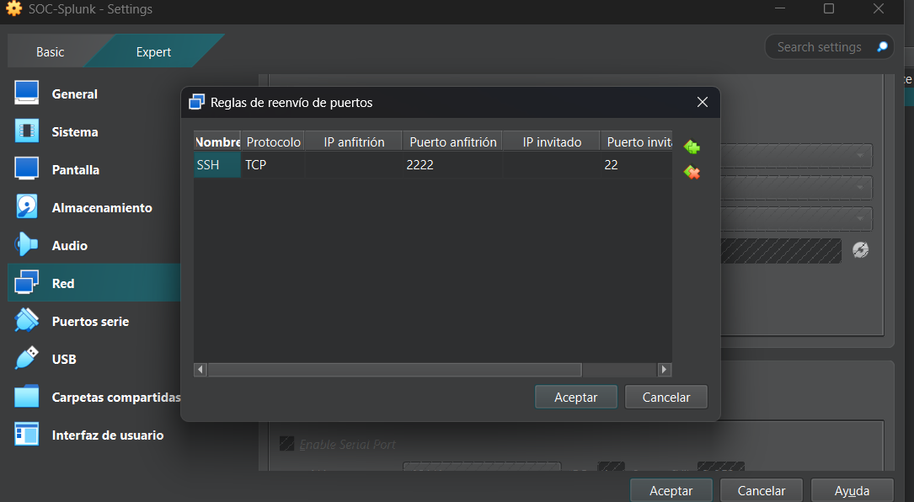
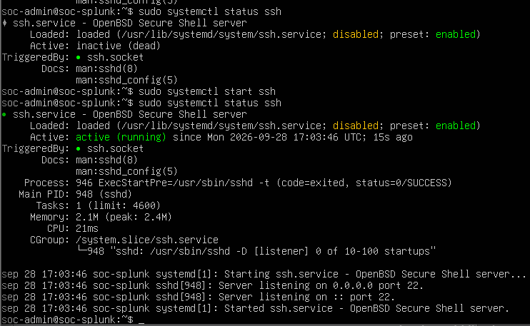
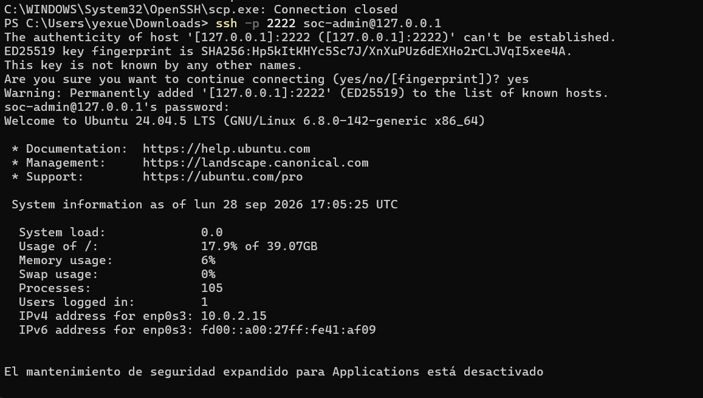
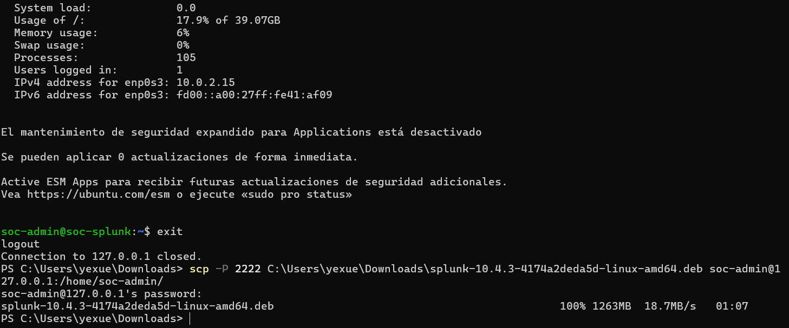
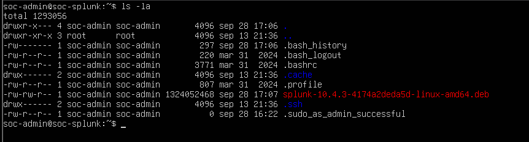

# Instalación de Splunk Enterprise
## Objetivo
El objetivo durante esta parte consistirá en realizar la instalación y configuración de Splunk Enterprise en el servidor Ubuntu. 

## Descarga
Splunk Enterprise será instalado en la máquina virtual Ubuntu Server 24.04.5 LTS previamente configurada.

## Licencia
Splunk Enterprise es una licencia de pago. Sin embargo, durante el desarrollo del proyecto se utilizará la versión de evaluación, permitiendo trabajar con funcionalidades necesarias para la creación de búsquedas, alertas e investigaciones. 

## Proceso de descarga 
1. Crear la cuenta en Splunk, para ello acceder al siguiente enlace: https://www.splunk.com/en_us/download/splunk-enterprise.html

2. Elegir el paquete de instalación, para el servidor Linux se escogerá el paquete correspondiente a Linux, 64-bit y formato .deb. 



El paquete oficial de Splunk Enterprise fue descargado desde la página oficial y transferido al servidor Ubuntu mediante SCP para realizar la instalación local.

Una vez descargado el paquete de Splunk Enterprise, se procedió a transferirlo desde el equipo anfitrión Windows al servidor Ubuntu mediante SCP.



Inicialmente se intentó realizar la transferencia utilizando directamente la IP
asignada por VirtualBox:

```bash
scp splunk-10.4.3-4174a2deda5d-linux-amd64.deb soc-admin@10.0.2.15:/home/soc-admin/
```

Sin embargo, la conexión no fue posible debido a la configuración de red NAT de VirtualBox. Aunque esta configuración permite que la máquina virtual tenga acceso a Internet, no permite acceder directamente desde el equipo anfitrión hacia la
máquina virtual.



Para solucionarlo, se configuró una regla de redirección de puertos en VirtualBox
para permitir conexiones SSH:



Posteriormente se comprobó el estado del servicio SSH en Ubuntu:



Tras comprobar que SSH estaba funcionando correctamente, se realizó una prueba de conexión desde Windows:



Una vez validado el acceso remoto, se transfirió el instalador de Splunk mediante SCP:



Desde el servidor de Ubuntu se puede comprobar que la transferencia de archivo se ha realizado con éxito 



El siguiente paso es instalar Splunk Enterprise: 