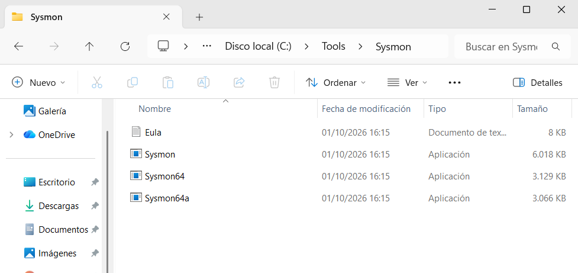
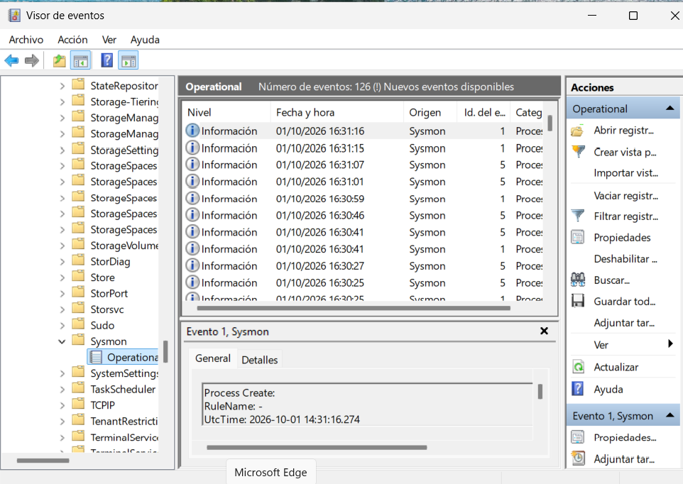
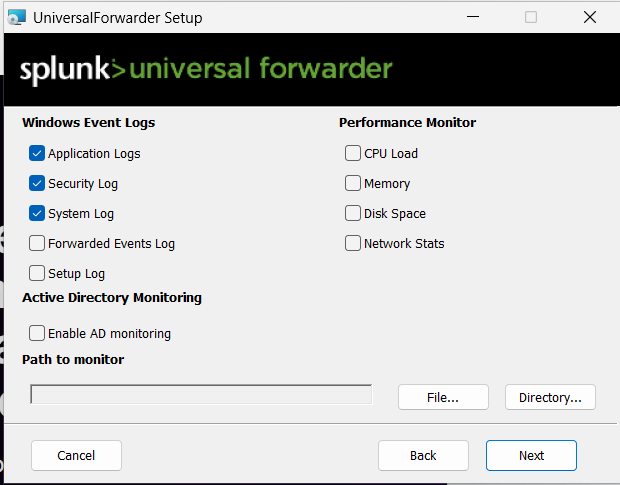
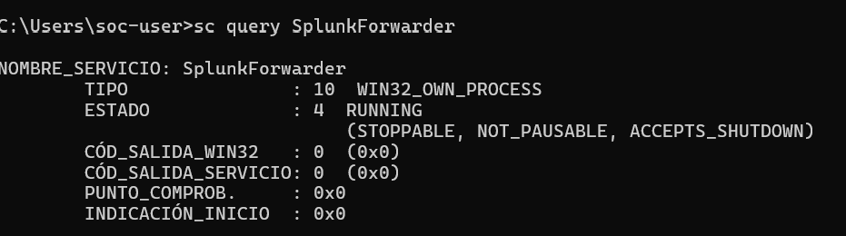

# Instalación de Windows

## Objetivo

El objetivo de esta fase es preparar una máquina virtual Windows que actuará como equipo monitorizado del SOC Homelab.

En ella se instalará:

- Sysmon: para registrar actividad del sistema.
- Splunk Universal Forwarder: para enviar los eventos al servidor Splunk.

Esta máquina también será utilizada para realizar las simulaciones de los escenarios de investigación.

## Configuración prevista

|           Recurso            |                   Asignación                  |
|------------------------------|-----------------------------------------------|
| Plataforma de virtualización |                   VirtualBox                  |
| Sistema operativo            |      Windows 11 Enterprise de evaluación      |
| Arquitectura                 |                     x86_64                    |
| Memoria RAM                  |                      4 GB                     |
| Procesadores virtuales       |                       2                       |
| Disco y red                  |           Pendientes de configurar            |

## Descarga del instalador
Para este laboratorio se ha elegido Windows 11 Enterprise de evaluación, con un periodo de uso de 90 días.
La descarga se realiza desde el siguiente enlace oficial:

[Centro de evaluación de Microsoft — Windows 11 Enterprise](https://www.microsoft.com/es-es/evalcenter/download-windows-11-enterprise)

Los pasos para obtener el instalador son:

1. Acceder a la página de Microsoft.
2. Seleccionar la ISO de Windows 11 Enterprise de 64 bits.
3. Elegir el idioma.
4. Guardar el archivo ISO en el equipo anfitrión.

La ISO se cargará en VirtualBox como medio de instalación de la nueva máquina virtual. No es necesario crear un USB de instalación.

## Configuración de la máquina 
Se configuró la máquina virtual con los siguientes recursos:

|        Recurso         | Configuración  |
|------------------------|----------------|
|      Memoria RAM       | 4096 MB (4 GB) |
| Procesadores virtuales |        2       |
|      Firmware EFI      |   Habilitado   |

Esta asignación inicial permitirá probar el funcionamiento de Windows junto al servidor Ubuntu con Splunk.

Instalación de Windows

Se creó una máquina virtual Windows para utilizarla como endpoint monitorizado dentro del laboratorio.
Durante la configuración inicial de Windows se utilizó una cuenta local en lugar de una cuenta de Microsoft.

## Sysmon 
A continuación, se instalará Sysmon en la máquina Windows para obtener mayor visibilidad sobre la actividad del sistema.

Permite registrar eventos como:
- Creación de procesos
- Conexiones de red
- Creación y modificación de archivos
- Actividad relacionada con PowerShell
- Cambios relevantes en el sistema

Los eventos generados por Sysmon se utilizarán posteriormente en Splunk para crear búsquedas y detecciones.

## Descarga de Sysmon

Sysmon se descargó desde la página oficial de Microsoft Sysinternals.

Versión utilizada: v15.22

Al descomprimir el zip descargado: 


## Instalación de Sysmon
Sysmon se instaló desde una consola CMD ejecutada como administrador.

Primero se accedió al directorio donde se encuentran los ejecutables:

```cmd
cd C:\Tools\Sysmon
```

Después se ejecutó la instalación:
```cmd
Sysmon64.exe -accepteula -i
```
## Comprobación de instalación
Se comprobó el funcionamiento de Sysmon mediante el Visor de eventos (Event Viewer) de Windows.

Los eventos generados por Sysmon se encuentran en:

Registros de aplicaciones y servicios → Microsoft → Windows → Sysmon → Operational



## Instalación de Splunk Universal Forwarder 
Slunk Universal Forwarder se encargará de enviar los eventos de Windows y Sysmon desde SOC-Windows al servidor SOC-Splunk.

### Descarga

Desde la máquina virtual SOC-Windows, accedí a la página oficial:
https://www.splunk.com/en_us/download/universal-forwarder.html

Una vez instalado, el siguiente paso fue realizar la configuración e instalación. 

## Instalación 

Durante la instalación se seleccionó la recogida de los registros de Windows **Application**, **Security** y **System**. También se recogerán los eventos de **Sysmon** para analizar la creación de procesos y detectar actividad sospechosa.



Una vez instalado, se realizó una verificación: 
