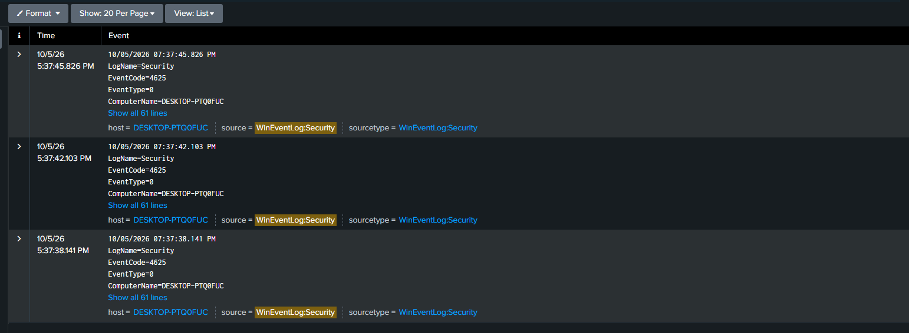
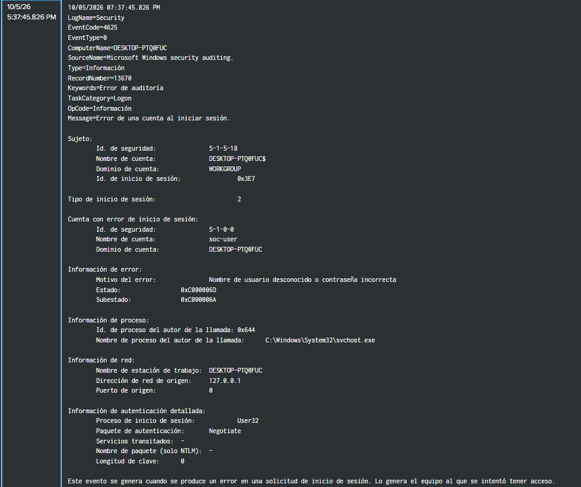
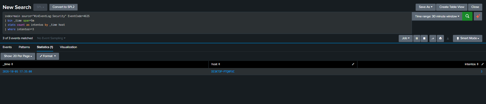
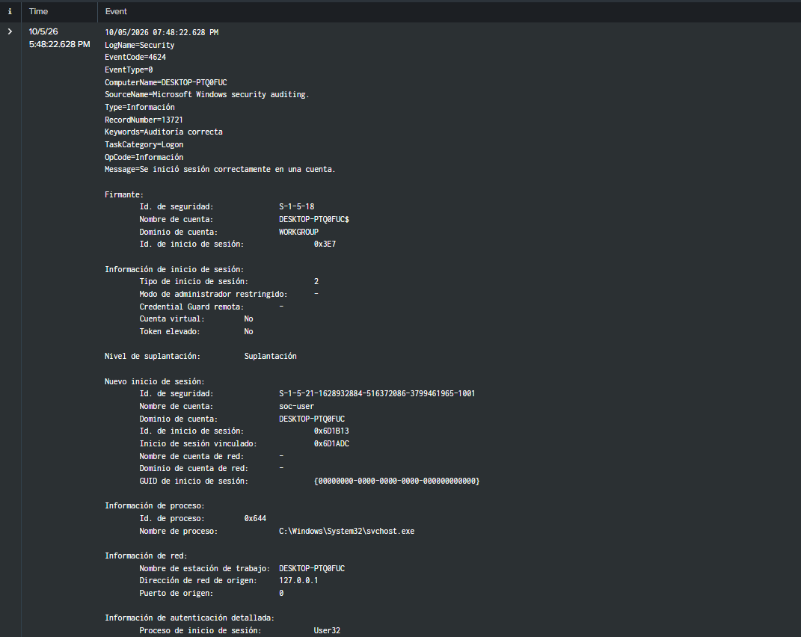

# Escenario 1: intentos fallidos de inicio de sesión
## Objetivo
Detectar varios intentos fallidos de inicio de sesión en el endpoint Windows a partir del registro de seguridad enviado a Splunk.

## Proceso
Para realizar la simulación de este escenario se introdujo tres veces una contraseña incorrecta para la cuenta local soc-user. Después se inició sesión con la contraseña correcta. La simulación se hizo en la propia VM, sin tráfico de acceso remoto.

Posteriormente en Splunk se realizó la siguiente búsqueda: 

index=index=main source="WinEventLog:Security" EventCode=4625

En Splunk aparecieron tres eventos con EventCode=4625 aproximadamente a las 19:37:38, 19:37:42 y 19:37:45, hora mostrada por la interfaz. 

 
Al abrir un evento se observó la siguiente información:

El valor 127.0.0.1 no prueba una conexión desde otro equipo. Este escenario demuestra visibilidad sobre fallos de autenticación locales; no representa un ataque remoto.

Para inspeccionar los eventos individuales:
index=main source="WinEventLog:Security" EventCode=4625
Para detectar al menos tres fallos en una misma ventana de cinco minutos y equipo:
index=main source="WinEventLog:Security" EventCode=4625
| bin _time span=5m
| stats count as intentos by _time host
| where intentos>=3

Por último, para comprobar un inicio de sesión correcto, se introdujo la contraseña correcta.  
En Splunk, se realizó la siguiente consulta SPL: 

index=main source="WinEventLog:Security" EventCode=4624

Splunk recibió los tres fallos de autenticación y permitió agruparlos mediante una búsqueda SPL. Un patrón así puede justificar una revisión, pero tres contraseñas incorrectas también pueden deberse a un error legítimo del usuario. La investigación debe considerar la cuenta, el origen y los accesos correctos posteriores.